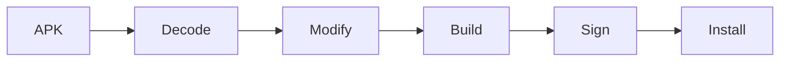

# Patching

Patching is frequently used to validate assumptions made during reverse engineering.

Typical examples include:

- Verifying whether a specific method controls a feature.
- Confirming that a conditional branch is executed.
- Enabling additional logging.
- Testing alternative execution paths.
- Replacing resources for debugging.

Patching is also common during security research.

Researchers may temporarily modify an application to better understand how it behaves under different conditions.

Examples include:

- Bypassing license verification.
- Disabling root detection.
- Removing SSL pinning.
- Skipping integrity checks.
- Unlocking developer features.
- Testing feature flags.

---

# What Can Be Patched?

Almost every part of an APK can be modified.

```
Application.apk

├── AndroidManifest.xml
├── Smali
├── Resources
├── Assets
└── Native Libraries
```

Each target serves a different purpose.

| Target              | Typical Purpose                                 |
| ------------------- | ----------------------------------------------- |
| AndroidManifest.xml | Modify permissions or application configuration |
| Smali               | Modify application logic                        |
| Resources           | Replace layouts, icons or strings               |
| Assets              | Modify bundled data                             |
| Native Libraries    | Modify native behaviour                         |

The complexity of a patch depends entirely on where the application's logic resides.

---

# Smali Patching

The most common Android patch consists of modifying Smali bytecode.

Consider the following method.

```smali
.method public isPremium()Z
    .locals 1

    const/4 v0, 0x0

    return v0
.end method
```

The method always returns `false`.

Changing

```smali
const/4 v0, 0x0
```

to

```smali
const/4 v0, 0x1
```

changes the returned value to `true`.

Although intentionally simple, this example illustrates an important point:

A very small modification can completely change an application's behaviour.

---

# Conditional Branches

Another common patch consists of modifying conditional branches.

Original code:

```smali
if-eqz v0, :cond_0

invoke-virtual {p0}, Lcom/example/MainActivity;->unlockPremium()V

:cond_0
```

Depending on the condition, the premium feature may or may not be unlocked.

---

# Rebuilding the APK

After modifying the decoded project, the application must be rebuilt.

A simplified workflow looks like this.



Android applications must always be signed before they can be installed.

Since the original developer's signing key is not available, rebuilt APKs are typically signed using a development key.

---

# Limitations

Modern Android applications often include mechanisms designed to detect or prevent modifications.

Common examples include:

- APK signature verification
- Integrity checks
- Root detection
- Emulator detection
- SSL pinning
- Anti-tamper protections

These mechanisms do not make reverse engineering impossible, but they often influence which techniques and tools are appropriate for a given investigation.

---

# Next

Rather than rebuilding an application after every modification, it is often possible to inspect and modify its behaviour while it is running.

The next chapter introduces **Frida**, one of the most widely used dynamic instrumentation toolkits for Android.

[07 - Frida](07-frida.md)
