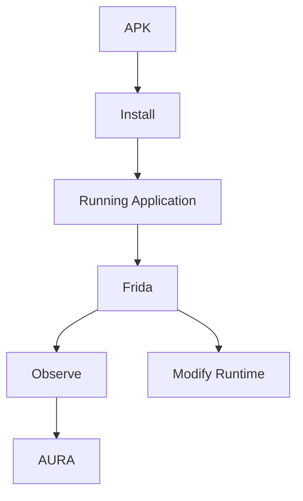

# Frida

Up to this point, every tool we've used has focused on **static analysis**.

We inspected the APK.

We decoded resources.

We explored Smali.

We decompiled Java.

Sometimes, however, the question you're trying to answer simply cannot be answered statically.

For example:

- Which method is executed after pressing this button?
- Which values are passed to this function?
- What is stored in memory?
- Which library is loaded first?
- Which network request is actually sent?

To answer these questions, we need to observe the application while it is running.

This is where **Frida** comes in.

---

# What is Frida?

Frida is a dynamic instrumentation toolkit.

Rather than modifying an application before it starts, Frida injects JavaScript into a running process, allowing you to inspect and interact with it in real time.

Unlike patching, the APK itself remains unchanged.



This makes experimentation significantly faster, since changes can often be tested without rebuilding and reinstalling the application.

---

# Instrumentation

Frida works by attaching to a running process and injecting your own code.

That code can:

- Observe function calls.
- Read memory.
- Modify arguments.
- Modify return values.
- Hook Java methods.
- Hook native functions.

A minimal Frida script might simply print a message when loaded.

```javascript
console.log("Hello from Frida!");
```

As you become more familiar with Frida, scripts can grow to instrument increasingly complex behaviours.

---

# Java and Native Instrumentation

One of Frida's strengths is its ability to instrument multiple layers of an Android application.

For example:

```
Android Application

├── Java
│      ↓
│   Java.perform()
│
└── Native
       ↓
   Interceptor.attach()
```

Java instrumentation is commonly used to inspect Android framework classes or application code.

Native instrumentation allows you to hook functions inside shared libraries (`.so`), making it particularly useful for applications that rely heavily on native code.

---

# Learning More

Frida is an extensive framework and this chapter only introduces the concepts needed for the rest of this handbook.

The official documentation provides an excellent reference covering Java instrumentation, native instrumentation, memory inspection and scripting.

https://frida.re/docs/

---

# Frida and Unity

Frida has become one of the most popular tools for reverse engineering Unity applications.

It allows researchers to:

- Observe Unity's native libraries.
- Inspect memory.
- Hook IL2CPP functions.
- Instrument application behaviour at runtime.

However, Frida itself has no understanding of Unity.

From Frida's perspective, a Unity application is simply another native process.

Understanding Unity concepts such as:

- Assemblies
- Classes
- GameObjects
- Components
- Scenes

requires additional work.

This is precisely the problem AURA aims to solve.

Rather than exposing only native pointers and functions, AURA provides Unity-aware runtime exploration built on top of Frida.

---

# Next

So far we've looked at Android applications from a general perspective.

The next chapter begins exploring Unity itself, starting with how Unity applications are structured and why they differ from traditional Android applications.

[10 - How Unity Works](10-how-unity-works.md)
