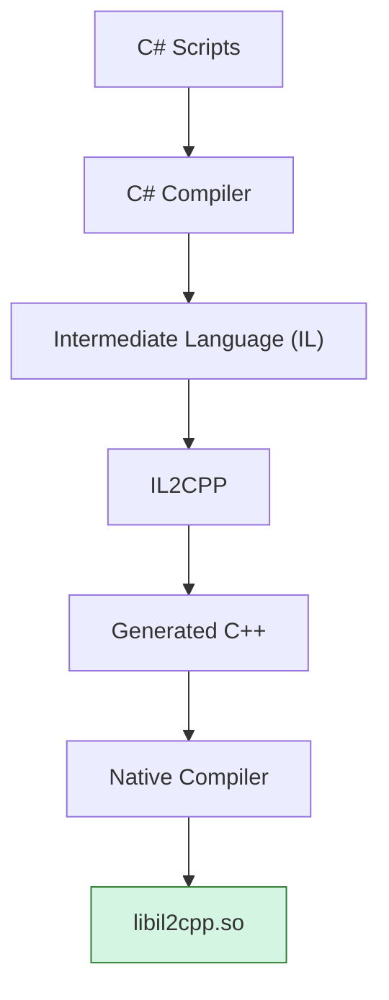
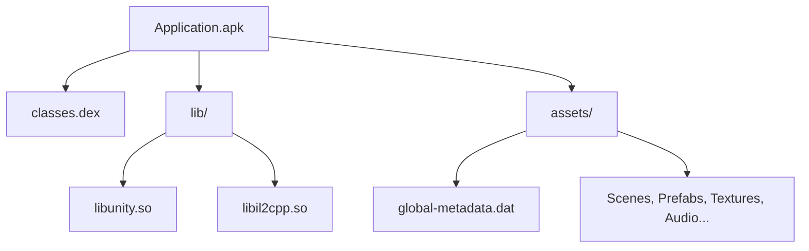
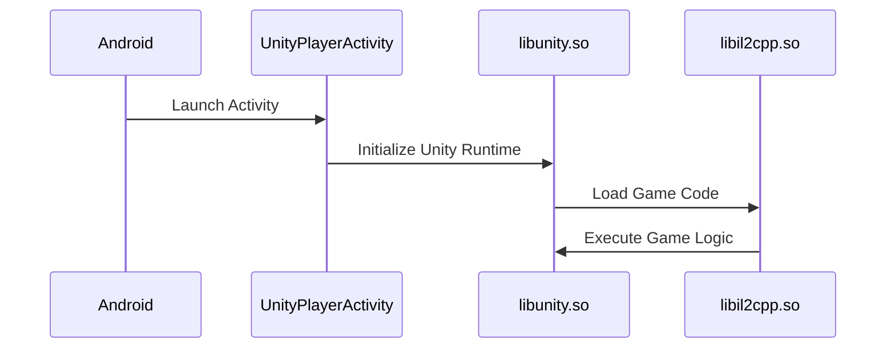

# Unity

Unity is one of the most widely used game engines in the world.

From Android's perspective, however, a Unity application is still just another Android application.

It is packaged as an APK, installed by Android and launched through an Android Activity, just like any other application.

At first glance, nothing appears unusual.

---

# A Traditional Android Application

For many Android applications, most of the application's logic lives inside the Java or Kotlin layer.

```
APK

├── classes.dex
│      ↓
│   Java / Kotlin
│
├── res/
│
└── lib/
```

Tools such as **JADX** usually provide a very good understanding of how these applications work.

---

# A Unity Application

Unity applications are packaged exactly the same way.

```
APK

├── classes.dex
├── assets/
├── lib/
└── ...
```

The important difference is **where the application's logic lives**.

Instead of implementing most features inside Java, the Java layer mainly acts as a bootstrap responsible for starting the Unity runtime.

Most gameplay, rendering, UI and business logic execute inside native libraries.

---

# Building a Unity Application

Although Unity developers write C#, those scripts are **not** included directly inside the APK.

Instead, Unity transforms them into native code during the build process.



At the end of this process, Unity has produced a native shared library (`libil2cpp.so`) containing machine code for the target platform.

On most modern Android devices, this means **ARM64 machine code**.

---

# Packaging

The generated native libraries are then packaged inside the APK together with the rest of the application.



At this point the APK contains several different kinds of data.

Each one requires different reverse engineering tools.

---

# Launching the Application

When the user starts the application, Android launches the application's main Activity.

For Unity applications, this is usually `UnityPlayerActivity`.

The launch sequence is simplified below.



Android's responsibility ends shortly after launching the Unity runtime.

From this point onward, Unity manages the application's execution.

---

# Why This Matters

This explains a common experience when reverse engineering Unity applications.

You launch JADX, you start searching for interesting classes.

After a few minutes, there isn't much Java left to inspect.

Nothing is wrong with JADX.

You're simply looking in the wrong place.

Most of the application logic has already moved into native code.

This fundamentally changes the reverse engineering workflow.

---

# Next

So far we've seen that Unity applications execute native code instead of running managed C# directly.

The next chapter introduces **Mono**, Unity's original scripting backend, and explains how it eventually evolved into **IL2CPP**.

[11 - Mono](11-mono.md)
