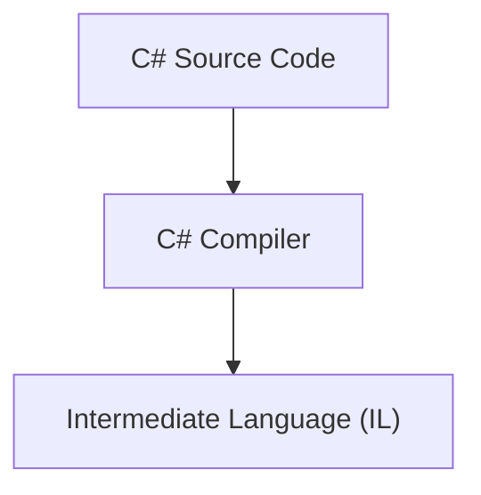
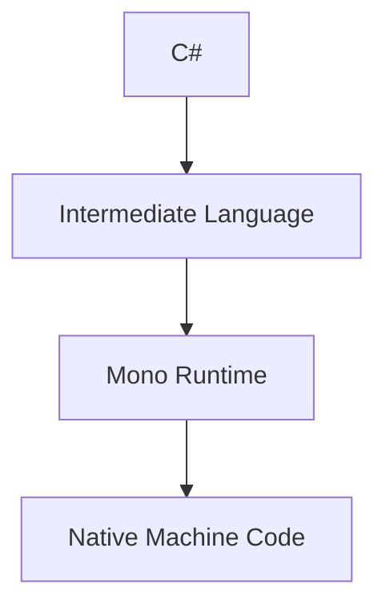
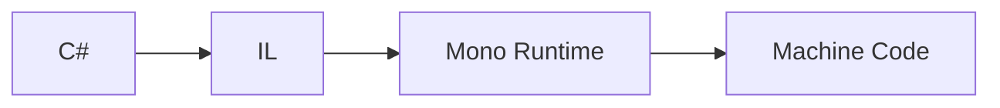
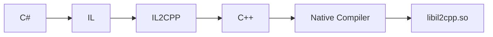

# Before IL2CPP

Modern Unity applications commonly use **IL2CPP** as their scripting backend.

However, this wasn't always the case.

For many years, Unity relied on **Mono** to execute C# code.

Understanding how Mono worked helps explain why IL2CPP was introduced and why Unity applications are structured differently today.

---

# Writing C#

From a Unity developer's perspective, nothing has changed.

The application is still written in C#.

```csharp
public class Player
{
    public int Health = 100;

    public void Damage(int amount)
    {
        Health -= amount;
    }
}
```

The difference lies entirely in how Unity executes that code.

---

# Intermediate Language (IL)

Before a C# application can run, it must first be compiled.

The C# compiler does **not** produce machine code directly.

Instead, it generates **Intermediate Language (IL)**, sometimes referred to as **CIL** (Common Intermediate Language).

IL is a platform-independent instruction set designed for the .NET runtime.

A simplified compilation pipeline looks like this.



At this stage, the code is no longer C#, but it is not yet executable by the CPU.

Something still needs to execute it.

---

# Enter Mono

This is where Mono comes in.

Mono is an open-source implementation of Microsoft's .NET runtime.

Its job is to execute IL produced by the C# compiler.

A simplified execution pipeline looks like this.



The Mono runtime loads assemblies, executes managed code, allocates objects, performs garbage collection and provides services such as reflection.

---

# Assemblies

Under Mono, Unity scripts are compiled into managed assemblies.

The most common one is:

```
Assembly-CSharp.dll
```

Additional assemblies may also exist depending on the project and installed packages.

These assemblies contain the application's managed code.

Unlike native libraries, they can be inspected directly using .NET decompilers.

---

# Reverse Engineering Mono Applications

From a reverse engineering perspective, Mono applications are relatively straightforward.

Opening `Assembly-CSharp.dll` with tools such as **dnSpy** or **ILSpy** often provides a very accurate reconstruction of the original C# source code.

For many applications, this means the majority of the application's logic can be explored without ever looking at native code.

---

# Why Replace Mono?

Mono worked well, but it also introduced several limitations.

One of the most important was **Just-In-Time (JIT) compilation**.

Instead of producing native machine code during the build process, Mono compiles methods as they are needed while the application is running.

This approach offers flexibility, but it also has drawbacks.

Some platforms, most notably **iOS**, do not allow applications to generate executable code at runtime.

Other considerations included:

- Faster application startup.
- Better runtime performance.
- Improved portability across platforms.
- Simpler deployment on platforms without JIT support.

Unity therefore introduced a different scripting backend.

Instead of executing IL at runtime, Unity would convert it into native C++ during the build process.

This backend became known as **IL2CPP**.

---

# Mono vs IL2CPP

Both scripting backends start in exactly the same way.

Unity developers still write C#.

The difference appears after the C# compiler has produced Intermediate Language.

With Mono:



With IL2CPP:



Both approaches execute the same application.

They simply reach native code differently.

---

# Why This Matters

Understanding Mono explains why IL2CPP exists.

Unity did not abandon C#.

It changed **how C# reaches native code**.

This distinction has a significant impact on reverse engineering.

With Mono, much of the application's logic can often be recovered directly from managed assemblies.

With IL2CPP, that managed code no longer exists inside the final application.

Instead, reverse engineers work with native libraries and metadata.

---

# Next

The previous chapter introduced Unity applications.

This chapter explained how Unity originally executed C# code using Mono.

The next chapter introduces **IL2CPP**, explains how C# becomes native code, and why this fundamentally changes the reverse engineering workflow.

[12 - IL2CPP](12-il2cpp.md)
