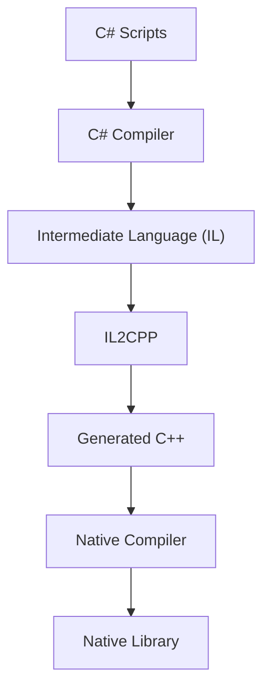
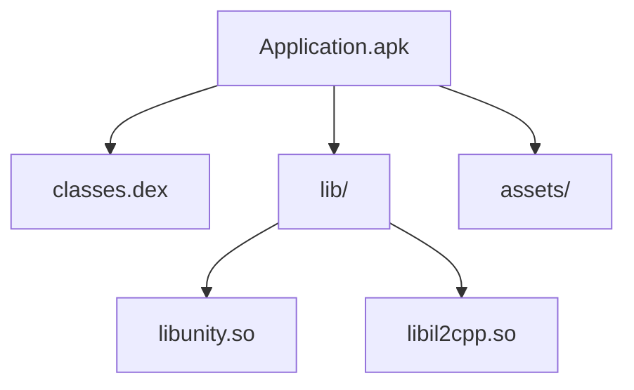

# IL2CPP

Modern Unity applications commonly use **IL2CPP** as their scripting backend.

IL2CPP stands for **Intermediate Language To C++**.

Instead of executing Intermediate Language (IL) at runtime, Unity converts it into C++ during the build process.

That C++ code is then compiled into native code for the target platform.

---

# The Build Pipeline

A simplified IL2CPP build pipeline looks like this.



From a Unity developer's perspective, nothing changes.

The project is still written entirely in C#.

Only the build process changes.

---

# From C# to Native Code

Consider the following Unity script.

```csharp
public class UIManager
{
    public void OpenPopup()
    {
        Show();
    }
}
```

When using IL2CPP, this code is **not** embedded inside the final APK.

Instead, Unity translates it into C++, then compiles that C++ into native machine code.

By the time the application is installed on an Android device, the original C# implementation no longer exists.

It has become native instructions executed directly by the CPU.

---

# Packaging

The generated native library is packaged inside the APK together with the rest of the application.



Unlike a traditional Android application, most gameplay and application logic now resides inside the native library.

---

# Reverse Engineering an IL2CPP Application

This changes the reverse engineering workflow considerably.

With a traditional Android application, tools such as JADX often provide access to most of the application's logic.

With IL2CPP, JADX mainly shows the Android bootstrap responsible for launching Unity.

The application's implementation has already been compiled into native code.

Understanding that code requires native reverse engineering tools such as **Ghidra** or **IDA**.

---

# Patching

The patching techniques introduced earlier in this handbook still apply.

The important difference is **where** they are applied.

For a traditional Android application, modifying Smali is often enough to change the application's behaviour.

```
APK

↓

Smali

↓

Modify

↓

Rebuild
```

For an IL2CPP application, most gameplay logic no longer exists inside Smali.

Instead, it has already been compiled into native code.

```
APK

├── classes.dex
│      ↓
│   Android Bootstrap
│
└── libil2cpp.so
       ↓
   Native Game Logic
```

Depending on the investigation, researchers may choose to:

- Patch native instructions.
- Modify Unity assets.
- Instrument the application at runtime using Frida.
- Hook Unity functions without modifying the APK.

The appropriate technique depends entirely on where the feature is implemented.

---

# What About Class and Method Names?

If all the C# code has become native machine code, an obvious question remains.

How can reverse engineering tools still recover names such as:

```
UIManager

OpenPopup()

GameController
```

The answer lies in another file generated during the build process.

---

# Next

Although the application's code has become native, Unity still needs information describing its managed world.

The next chapter introduces **global-metadata.dat**, explains what it contains, and why it is essential for reverse engineering IL2CPP applications.

[13 - global-metadata.dat](13-global-metadata.md)
