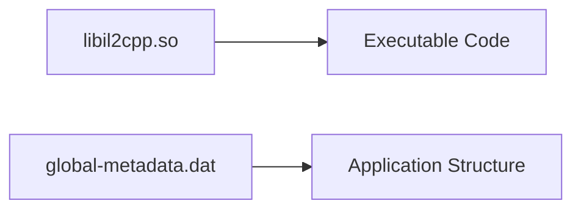
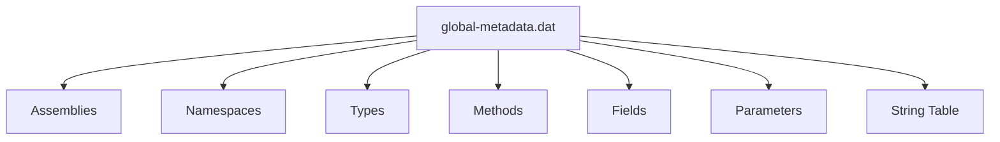
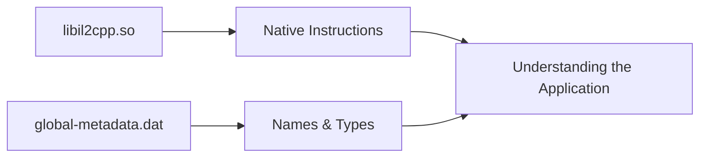

# What Is Metadata?

Metadata is simply **data describing other data**.

In the context of Unity, metadata describes the application's managed world.

For example, it records information such as:

- Assemblies
- Namespaces
- Classes
- Methods
- Fields
- Properties
- Interfaces
- Generic types
- Attributes

Notice that none of these represent executable code.

Instead, they describe the application's structure.

---

# Code vs Metadata

A useful way to think about an IL2CPP application is to separate it into two parts.



The native library contains instructions executed by the CPU.

The metadata describes what those instructions originally represented in the managed application.

---

# What's Inside?

Although the internal format is complex, it can be simplified as a collection of tables describing the application's structure.



These structures reference each other to describe the managed application.

For example, a type references its methods, while methods reference their parameters and return types.

---

# A Simple Example

Consider the following class.

```csharp
public class UIManager
{
    public void OpenPopup()
    {
        Show();
    }
}
```

The metadata records information similar to:

```
Assembly

↓

Namespace

↓

UIManager

↓

OpenPopup()

↓

Return Type

↓

Parameters
```

Notice what is missing.

The implementation of:

```csharp
Show();
```

is **not** stored in the metadata.

Only the method's description survives.

The executable implementation already exists inside `libil2cpp.so`.

---

# Why Is Metadata Important?

Without metadata, reverse engineering an IL2CPP application would be significantly more difficult.

Imagine opening `libil2cpp.so` directly inside Ghidra.

Instead of meaningful names, you might only see functions such as:

```
sub_2945DA8

sub_2945F20

sub_29461A0
```

Those names provide no context.

Metadata allows reverse engineering tools to associate those native functions with their original managed names.

For example:

```
UIManager::OpenPopup()

GameController::Start()

Board::Initialize()
```

Although the implementation remains native, understanding it becomes much easier.

---

# Metadata Is Not Source Code

A common misconception is that `global-metadata.dat` contains the original C# source code.

It does not.

Metadata describes the application's structure.

It does **not** contain:

- Method bodies
- Algorithms
- Native instructions
- Application logic

Those remain inside `libil2cpp.so`.

---

# Metadata Alone Is Not Enough

Likewise, metadata cannot execute anything.

Removing `libil2cpp.so` leaves only descriptions.

Removing `global-metadata.dat` leaves executable code with very little context.

Both files are required to reconstruct a meaningful view of an IL2CPP application.



---

# Next

So far we've focused on Unity's executable code and metadata.

The application also contains scenes, prefabs, textures, audio and many other assets.

The next chapter introduces Unity assets and explains how they fit into the overall structure of a Unity application.

[14 - Unity Assets](14-unity-assets.md)
