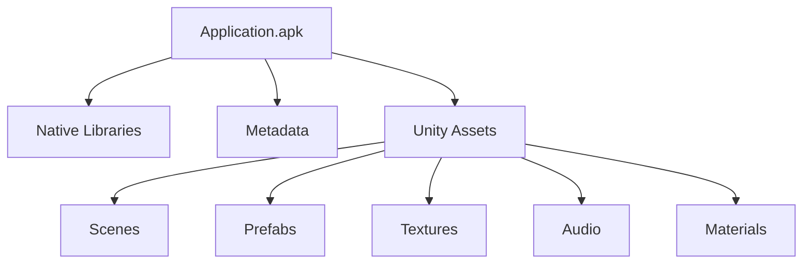

# Unity Assets

So far we've focused on **code** and **metadata**.

A Unity application, however, contains much more than executable code.

Scenes, prefabs, textures, materials, audio, animations and many other resources are all packaged alongside the application's native libraries.

These are collectively referred to as **assets**.

---

# What Is an Asset?

An asset is any file used by Unity to build or run an application.

Common examples include:

- Scenes
- Prefabs
- Textures
- Sprites
- Materials
- Audio clips
- Animations
- Fonts
- ScriptableObjects
- Shaders

Unlike C# scripts, assets are generally created using the Unity Editor rather than a code editor.

---

# Assets Are Data

One of the most important concepts in Unity is the separation between **code** and **data**.

Consider a simple shop popup.

The C# code defines its behaviour.

```csharp
public class UIPopup_ShopGold : MonoBehaviour
{
    public void OnClickBuy()
    {
        ...
    }
}
```

The asset defines how that popup looks.

For example:

- Position
- Size
- Images
- Buttons
- Text
- Animations
- References to other objects

The behaviour and the visual representation are stored separately.

---

# Scenes

Scenes represent the different environments of a Unity application.

Examples include:

- Main Menu
- Loading Screen
- Shop
- Gameplay
- Settings

A scene contains a hierarchy of **GameObjects**.

For example:

```
Main Menu

├── Canvas

├── Camera

├── EventSystem

└── ShopPopup
```

Scenes do not contain executable code.

Instead, they describe how objects should be instantiated when the scene is loaded.

---

# GameObjects

Every object visible inside a Unity scene is represented by a **GameObject**.

Examples include:

- Buttons
- Images
- Cameras
- Lights
- Characters
- Particle systems

GameObjects are containers.

Their behaviour comes from attached **Components**, a concept we'll explore later in the handbook.

---

# Prefabs

Prefabs are reusable GameObjects.

Instead of rebuilding the same object multiple times, Unity allows developers to create a reusable template.

For example:

```
Enemy

↓

Prefab

↓

Enemy #1

Enemy #2

Enemy #3
```

Changing the prefab automatically updates every instance that uses it.

Prefabs are one of the fundamental building blocks of Unity projects.

---

# Assets Inside the APK

Unity packages assets together with the application.

A simplified view looks like this.



Unlike native libraries, these files are not executable.

They describe the content of the application rather than its behaviour.

---

# Why Reverse Engineers Care

Assets often reveal information that cannot be recovered from code alone.

For example:

- UI layouts
- Scene hierarchies
- Button names
- Sprites
- Icons
- Audio
- Character models
- Animation clips

Understanding these assets provides valuable context during an investigation.

---

# Code and Assets Work Together

Imagine a shop popup.

The code contains:

```
UIPopup_ShopGold

↓

OnClickBuy()
```

The assets contain:

```
ShopPopup

├── Buy Button

├── Close Button

├── Price Label
```

Neither side tells the complete story.

Only together do they describe how the feature actually works.

---

# What's Next?

Assets are stored in Unity's own serialized format.

The next chapter introduces **AssetRipper**, explains how Unity assets can be recovered from an application, and shows why it has become one of the most valuable tools in the Unity reverse engineering workflow.

[15 - AssetRipper](15-assetripper.md)
