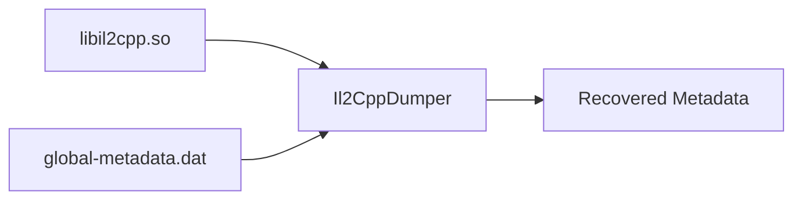
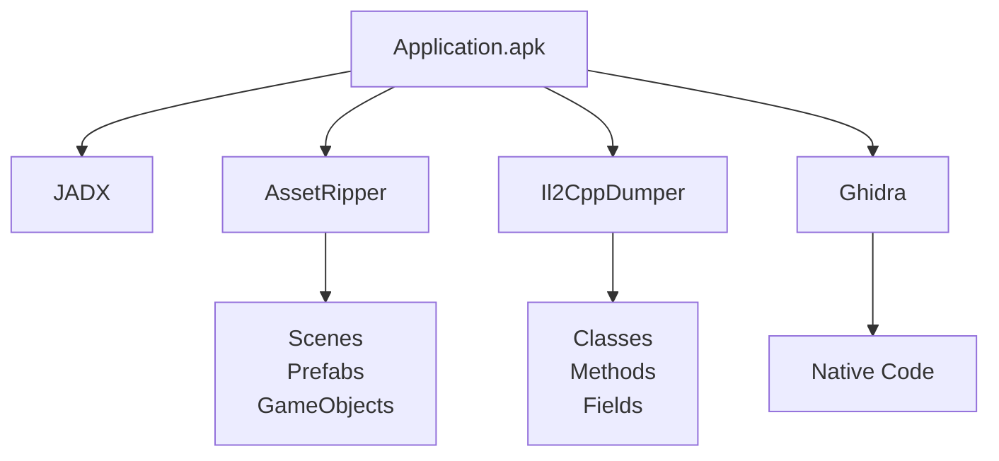

# Il2CppDumper

At this point we've identified the two most important files in an IL2CPP application.

```
libil2cpp.so
```

contains the application's executable code.

```
global-metadata.dat
```

contains information describing the application's managed structure.

Individually, neither file provides a complete understanding of the application.

This is the problem **Il2CppDumper** solves.

---

# What Does Il2CppDumper Do?

Il2CppDumper combines information from both files to reconstruct the application's managed structure.

In simplified terms, the workflow looks like this.



Rather than decompiling native code, Il2CppDumper reconstructs information about the original C# project.

---

# What Does It Recover?

Depending on the Unity version, Il2CppDumper can recover information such as:

- Assemblies
- Namespaces
- Classes
- Methods
- Fields
- Properties
- Method addresses
- Type information

This information dramatically improves navigation inside reverse engineering tools.

---

# DummyDll

One of Il2CppDumper's most useful outputs is the **DummyDll** project.

Instead of presenting native functions, it reconstructs the application's managed structure as C# classes.

For example:

```csharp
public class UIManager
{
    public void OpenPopup()
    {
    }
}
```

At first glance, this looks strange.

The methods are empty.

This is expected.

DummyDll does **not** recover the original implementation.

It reconstructs the application's structure, making it much easier to navigate classes, methods and fields.

The implementation itself still lives inside `libil2cpp.so`.

---

# Why Are Empty Methods Useful?

Even without implementations, DummyDll provides valuable information.

For example:

```csharp
public class UIManager
{
    public void OpenPopup();

    public void ClosePopup();

    public void OpenMenu();
}
```

Immediately, we learn:

- A `UIManager` class exists.
- It exposes three public methods.
- Those methods probably control the application's user interface.

This often provides enough context to continue the investigation elsewhere.

---

# Additional Outputs

Depending on the selected options, Il2CppDumper can also generate additional files.

Common outputs include:

- `DummyDll`
- `script.json`
- C headers
- IDA scripts
- Ghidra scripts

These files help bridge the gap between Unity metadata and native reverse engineering tools.

---

# Working with Ghidra

Without metadata, Ghidra typically displays anonymous functions.

```
FUN_002945DA8
```

After importing Il2CppDumper's generated scripts, those functions become significantly easier to understand.

For example:

```
UIManager::OpenPopup()

GameController::Initialize()

Player::Damage()
```

Although the code itself has not changed, meaningful names make navigation considerably easier.

---

# Limitations

Il2CppDumper is often misunderstood.

It does **not** recover:

- Original C# source code.
- Method implementations.
- Runtime memory.
- Live objects.
- Current application state.

Its purpose is to reconstruct metadata, not executable code.

Understanding this distinction helps avoid many common misconceptions.

---

# A Typical Workflow

A typical Unity reverse engineering workflow now looks something like this.



Each tool contributes a different part of the overall picture.

---

# Why This Matters

Il2CppDumper is often the bridge between Unity's managed world and native code.

Without it, reverse engineering an IL2CPP application quickly becomes an exercise in navigating anonymous native functions.

With it, the application's original structure begins to reappear.

---

# Next

At this point we understand how Unity applications are built, how assets are stored and how metadata can be reconstructed.

The next section of this handbook explores the native libraries themselves and introduces the tools commonly used to inspect their implementation.

[20 - Ghidra](20-ghidra.md)
