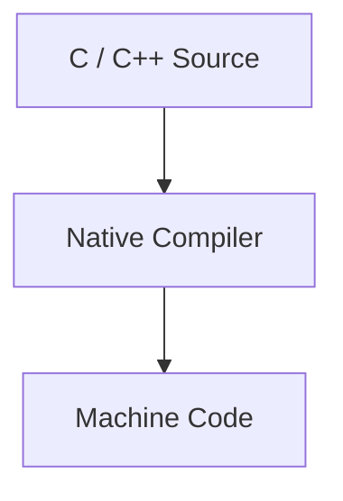

# Native Analysis

Throughout this handbook we've explored several layers of an Android application.

- Java and Kotlin code
- Smali bytecode
- Unity assets
- IL2CPP metadata

The remaining piece of the puzzle is the application's **native code**.

Understanding native code is an essential part of reverse engineering modern Unity applications.

---

# Native Code

Unlike Java or C#, native code is compiled specifically for a processor architecture.

For example, most modern Android devices use **ARM64** processors.

Instead of executing Java bytecode or Intermediate Language (IL), the processor executes native machine instructions directly.

A simplified compilation pipeline looks like this.



These machine instructions are packaged inside native shared libraries.

---

# Shared Libraries

On Android, native code is usually distributed as **shared libraries**.

These files use the `.so` extension, which stands for **Shared Object**.

Examples include:

```
libunity.so

libil2cpp.so

libfirebase.so
```

Unlike Java code stored inside `classes.dex`, these libraries contain machine instructions executed directly by the CPU.

---

# Machine Code

Machine code is the lowest level of software executed by the processor.

It consists of binary instructions specific to a processor architecture.

For humans, raw machine code is almost impossible to read.

```
F9 03 00 AA

94 12 4A 18

D6 5F 03 C0
```

Reverse engineering tools therefore translate these instructions into more understandable representations.

---

# Assembly

The first representation is **assembly language**.

Assembly provides a human-readable version of machine instructions.

For example:

```asm
MOV X0, X19

BL 0x123456

RET
```

Although assembly is still low level, it is significantly easier to understand than raw hexadecimal instructions.

Assembly is the closest representation of what the processor actually executes.

---

# Decompilation

Modern reverse engineering tools go one step further.

Instead of showing only assembly, they attempt to reconstruct higher-level code.

```
Machine Code

↓

Assembly

↓

Pseudo-C
```

For example:

Assembly

```asm
MOV W0, #1

RET
```

may be decompiled into something like:

```c
return 1;
```

This is **not** the original source code.

It is the tool's best interpretation of the compiled instructions.

---

# Native vs Java

If you've already used JADX, this process should feel familiar.

JADX reconstructs Java from DEX bytecode.

Native decompilers reconstruct C-like code from machine instructions.

| Java               | Native                      |
| ------------------ | --------------------------- |
| DEX Bytecode       | Machine Code                |
| JADX               | Ghidra / IDA / Binary Ninja |
| Reconstructed Java | Decompiled pseudo-C         |

In both cases, the displayed code is reconstructed.

The original source code no longer exists.

---

# Next

Although each tool has its own interface, the concepts discussed throughout this section apply equally to all of them.

For the remainder of this handbook, we'll primarily use **Ghidra** because it is free, cross-platform and widely adopted within the reverse engineering community.

The next chapter introduces **Ghidra**, explains how it analyzes native libraries, and demonstrates how it fits into the Unity reverse engineering workflow.

[21 - Ghidra](21-ghidra.md)
