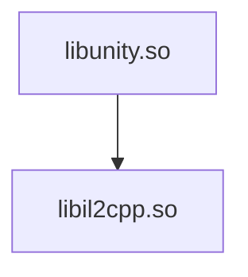
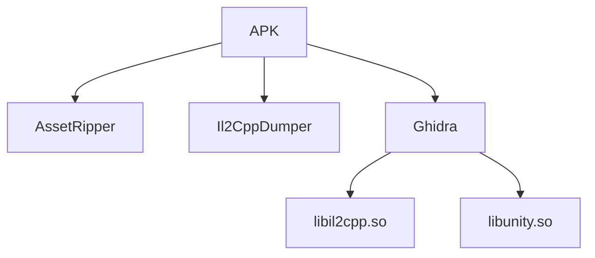

# libunity.so

By now we've seen that Unity applications rely heavily on native code.

One of the first native libraries you'll encounter is:

```
libunity.so
```

Unlike `libil2cpp.so`, this library is **not generated from your game's C# scripts**.

Instead, it contains the Unity engine itself.

---

# The Unity Engine

Think of Unity as two separate parts.

The **engine** is responsible for providing the systems developers build upon.

Your **game** contains the logic specific to your application.

A simplified view looks like this.



The engine provides the functionality.

The game tells the engine what to do.

---

# What Does It Contain?

Although Unity's implementation changes between versions, `libunity.so` typically contains systems responsible for:

- Rendering
- Audio
- Physics
- Animation
- Scene management
- Asset loading
- Input
- Memory management

These systems are shared by every Unity application built with the same engine version.

Unlike `libil2cpp.so`, they are **not specific to your game**.

---

# Why Does It Matter?

During reverse engineering, it's useful to distinguish between engine code and game code.

Suppose you're investigating why a popup opens.

The function responsible for deciding **when** to open the popup is likely part of your game's code.

The function responsible for drawing that popup on the screen belongs to the Unity engine.

Understanding which library you're currently analyzing helps determine what kind of code you're looking at.

---

# Reverse Engineering libunity.so

Unlike `libil2cpp.so`, reverse engineering `libunity.so` is rarely the starting point.

Most investigations focus first on the application's own logic.

Only when understanding Unity's internal behaviour becomes necessary does the engine itself become the target of analysis.

Examples include:

- Understanding how Unity loads assets.
- Investigating rendering behaviour.
- Following scene loading.
- Exploring the engine's internal systems.

For many investigations, it is entirely possible to understand the application without spending much time inside `libunity.so`.

---

# Reverse Engineering Workflow

A simplified Unity reverse engineering workflow often looks like this.



Most investigations begin with `libil2cpp.so`.

`libunity.so` becomes useful when the investigation reaches the engine itself.

---

# Next

Unlike `libunity.so`, the `libil2cpp.so` library is generated specifically for your application.

The next chapter explores its structure and explains why it is one of the most important files in Unity reverse engineering.

[23 - libil2cpp.so](23-libil2cpp.md)
