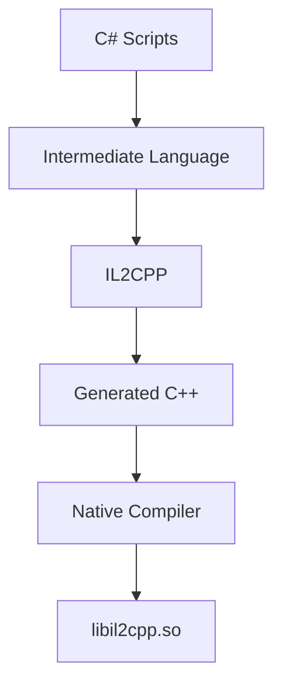
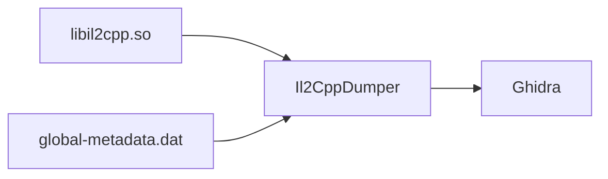

# libil2cpp.so

Throughout the previous chapters we've repeatedly encountered one file:

```
libil2cpp.so
```

Unlike `libunity.so`, which contains the Unity engine itself, `libil2cpp.so` contains the native code generated from your application's C# scripts.

In many ways, it is the native equivalent of the project's original managed assemblies.

---

# Where Does It Come From?

When Unity builds an IL2CPP application, every C# script follows the same pipeline.



The result is a native shared library containing your application's executable code.

---

# What Does It Contain?

Although the original C# no longer exists, its behaviour does.

For example, consider the following Unity script.

```csharp
public class Player
{
    public int Health = 100;

    public void Damage(int amount)
    {
        Health -= amount;
    }
}
```

After the IL2CPP build process, the original implementation no longer exists as C#.

Instead, the application's behaviour has been compiled into native machine instructions stored inside `libil2cpp.so`.

---

# More Than Game Logic

While gameplay code is a major part of `libil2cpp.so`, the library contains much more than that.

Examples include:

- Generated methods
- Runtime support code
- Generic implementations
- Exception handling
- Garbage collection interfaces
- Reflection support
- Internal IL2CPP runtime functions

Some of these functions originate from your application.

Others are generated automatically by Unity.

---

# Exploring libil2cpp.so

Opening the library in Ghidra reveals thousands of functions.

Without additional information, many appear simply as:

```
FUN_001A42B0

FUN_001A4388

FUN_001A4400
```

At first glance, distinguishing game code from generated runtime code can be difficult.

This is one of the reasons metadata recovery is so important.

---

# Bringing the Pieces Together

By combining several tools, the native library gradually becomes easier to understand.



The executable code remains exactly the same.

The difference is that native functions now have meaningful names and types instead of anonymous addresses.

---

# Relative Virtual Addresses (RVAs)

When working with `libil2cpp.so`, you'll frequently encounter **Relative Virtual Addresses**, commonly abbreviated as **RVAs**.

For example:

```
UIManager::OpenPopup()

RVA: 0x2945DA8
```

An RVA identifies the location of a function relative to the beginning of the library.

Reverse engineering tools, patching tools and runtime instrumentation frameworks commonly use RVAs to locate functions.

As a result, you'll encounter RVAs throughout Unity reverse engineering.

---

# Patching Native Code

Unlike traditional Android applications, modifying gameplay behaviour often requires patching native instructions rather than Smali.

Typical examples include:

- Changing return values.
- Skipping conditional branches.
- Replacing instructions with NOPs.
- Redirecting execution.

Native patching is significantly more complex than Smali patching because it requires understanding machine instructions for the target architecture.

For this reason, many reverse engineers prefer runtime instrumentation whenever possible.

---

# Runtime Instrumentation

Instead of modifying `libil2cpp.so` directly, another approach is to observe or modify its behaviour while the application is running.

This has several advantages.

- The APK remains unchanged.
- Changes can be tested immediately.
- Different behaviours can be explored without rebuilding the application.

This approach is commonly used with tools such as **Frida**.

It is also the approach taken by **AURA**.

Rather than modifying the native library, AURA focuses on exploring and instrumenting Unity's runtime.

---

# Bringing Everything Together

At this point, we've explored every major part of a Unity IL2CPP application.

```
Application.apk

├── Android Layer
│      ↓
│   JADX
│
├── Unity Assets
│      ↓
│   AssetRipper
│
├── Metadata
│      ↓
│   Il2CppDumper
│
└── Native Code
       ↓
    Ghidra
```

Each tool answers a different question.

Together, they provide a much more complete understanding of the application than any single tool alone.

---

# Next

Before moving on to runtime analysis, we'll put everything we've learned into practice.

The next section follows a complete reverse engineering investigation of the **Goods Sorting** application, applying each of the techniques introduced throughout this handbook.
